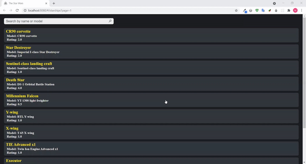

# Trendyol Front-End Bootcamp | VueJS Assignment
Simple VueJS application that lists the starships elements using [The Star Wars API](https://swapi.dev/) 
You can search for a specific starship also by name or model 

## Built With
- VueJS
- The Star Wars API

## How to install
- clone project
```sh
git clone https://github.com/Trendyol-Front-End-Bootcamp/week-4-vue-mahmud-mardini.git
cd week-4-vue-mahmud-mardini
```

- Install dependencies
```sh
npm install
```

- lints and fixes files
```sh
npm run lint
```

- run the app
```sh
npm run serve
```

## Preview

